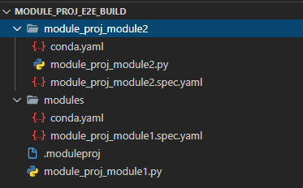

# Definition of module project (draft)

This document describes the specification to define a `.moduleproj`. The spec should be in YAML file format.


A module project file contains a map from keyword `module` to a list of module configurations.  

## Module Configuration

| Name                     | Type   | Required                                               | Description                                                  |
| ------------------------ | ------ | ------------------------------------------------------ | ------------------------------------------------------------ |
| entry                    | String | Yes(No for yaml module, add a section to distinguish?) | Module entry for dsl.module. Value should be relative path to source directory. |
| sourceDirectory          | String | No                                                     | Specify the source directory of the module. Refer to [here](https://github.com/Azure/DesignerPrivatePreviewFeatures/blob/master/azureml-modules/docs/module-spec-topics/source-directory.md) for details. Will be current directory if not specified. Value should be relative path to module project file. |
| spec                     | String | No                                                     | Spec file location. Will be `./entry-name.spec.yaml` if not specified. Value should be relative path to source directory. |
| preBuild/postBuild(TODO) |        | No                                                     |                                                              |

TODO: yaml module configuration

## Example

```yaml
modules:
-   entry: module_proj_module1.py
    spec: modules/module_proj_module1.spec.yaml # source directory not specified: default value . will be taken
-   entry: module_proj_module2.py 
    sourceDirectory: module_proj_module2 # spec not specified: default value module_proj_module2.spec.yaml will be taken
```



## Future work

### Support yaml module

```yaml
modules:
-   spec: yaml_module1.spec.yaml # yaml module
-   entry: dsl_module_entry.py # dsl.module
```

### Support pre-post build

```yaml
modules:
-   entry: dsl_module_entry.py
    preBuild: ./pre-build.ps1 # this will be executed before building
    postBuild: ./post-build.ps1 # this will be executed after building
```

